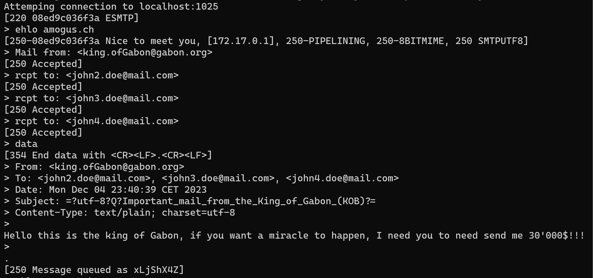
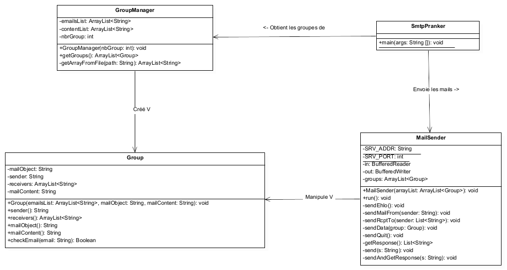

# dai-lab04-SMTP
- [Description du projet](#description-du-projet)
- [Utilisation de l'application](#utilisation-de-lapplication)
- [Utilisation avec MailDev](#utilisation-avec-maildev)
- [Description de l'implémentation](#description-de-limplémentation)

## Description du projet
Le but de ce projet est d'implémenter partiellement un client SMTP afin d'automatiser l'envoie de blague par mail. Ceci est à but formatif et non de réellement envoyer des spams et devrait être utilisé uniquement dans un environement de test.

## Fonctionnement de l'application
SmtpPranker créé des groupes d'adresses email en leurs assignant un objet et un contenu. L'application va ensuite envoyer un email par groupe sur un serveur SMTP.
L'application utilise deux fichiers de configuration nommés victimes.txt et jokes.txt qui contiennent une liste d'adresses email et une liste d'objets et de contenus de mail.
Chaque groupe a un objet et un contenu différents des autres et une liste d'adresses email, la première étant celle du faux émetteur.

## Utilisation de l'application
Pour utiliser l'application il faut commencer par compiler le code source avec [Maven](https://maven.apache.org) pour avoir un package java .jar. Pour cela, il faut ouvrir le répertoire contenant le fichier *pom.xml* et lancer la commande suivante:
```
mvn clean package
```

Ensuite, il faut copier le dossier **config** (contenant les fichiers jokes.txt et victimes.txt) dans le même répertoire que le fichier .jar (par défaut dans le dossier target). Le fichier **jokes.txt** doit être encodé en UTF-8 et contenir un objet par ligne suivi d'un contenu de mail par ligne comme par exemple :
```
Object1
Content1
Object2
Content2
.
.
.
```
Pour exécuter l'application, lancer un terminal dans le répertoire où se trouve SmtpPranker-1.0.jar et faire la commande suivante en indiquant le nombre de groupe à créer :
```
java -jar ./SmtpPranker-1.0.jar <nb groupes>
```

## Utilisation avec MailDev
Pour tester notre application, nous avons utilisé [MailDev](https://maildev.github.io/maildev/), qui est un serveur SMTP qui peut recevoir des mails sans les envoyer à des personnes réelles. Pour l'utiliser, il faut avoir [Docker](https://www.docker.com/) installé puis télécharger et lancer l'image avec la commande suivante:
```
docker run -d -p 1080:1080 -p 1025:1025 maildev/maildev
```

Le serveur est atteignable sur l'adresse localhost et utilise le port 1025 pour la réception des mail et le port 1080 pour l'interface web permettant de consulter les mails envoyé.


## Description de l'implémentation
Le programme fonctionne de la manière suivante: Il va commencer par lire les fichiers victimes.txt et jokes.txt afin de créer des **Group** qui contiennet l'adresse de l'expéditeur ainsi que des victimes, le sujet du mail et le corp du message. Une fois cela fait, le programme va se connecter en TCP à l'adresse localhost:1025 (qui correspond au serveur MailDev) et communiquer avec celui-ci en SMTP.
Exemple de communication (> = message du programme, [] = réponse du serveur) :



### Diagramme de classes de l'application


### Classe GroupManager
La classe GroupManager se charge de lire les deux fichiers de configuration pour créer le nombre de groupes demandé par l'utilisateur. 
Par exemple si l'utilisateur demande 5 groupes et qu'il y a 20 adresses email dans le fichier victimes.txt, le programme va choisir 20/5=4 adresses email par groupe. 
Il faut au minimum 2 adresses pour constituer un groupe, le programme indiquera une erreur s'il y en a pas assez.
